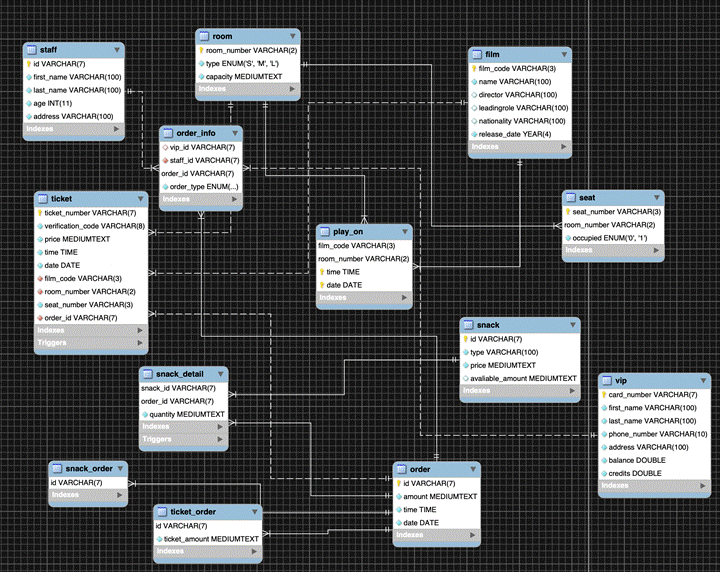
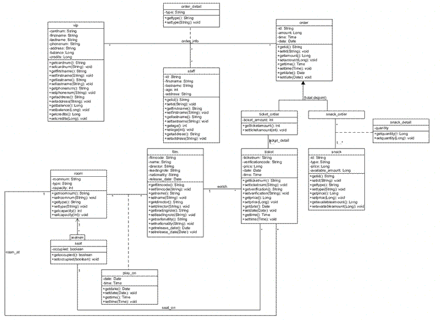

# Cinema database

## Description

This is a Data management(Database design) project for **IE 7374 GR ST:Data Mngmt for Analytics** in Northeastern University. This project is mainly about **designing a ticketing database**. The problem definition and requirement  are shown below.  **You can read the report file in materials for more detail about this project. The code is in Mysql Scripts file for generating this database**.

## Business problem definition

With the development of 3D and iMax technology, the experience of watching films in the cinema becomes increasingly better than that at home. People tend to go out for entertainment nowadays. As the number of customers grows, traditional management may require more human resources and financial resources. A management method with higher efficiency and confidentiality will help the cinema to better improve its operation. We designed a ticketing database to meet these requirements.

## Requirements

The ticketing database for a cinema should meet the following requirements:

1. It has the basic functions including playing the films, selling tickets, checking tickets, dealing with useless data.

2. It can be applied to the snack corner, either.

3. It can deal with the expired tickets.

4. A customer can choose whether to buy a ticket for one time, or to join the vip club which has more discounts.

## Design 

We suppose that if a customer want to join the VIP club, he must prepay for a VIP card. Each consumption in the cinema using the VIP card will add a credit of 10% of the bill to his account. He can use the credit to buy goods in the snack corner or buy film tickets.The ticketing database is made up of 3 parts, ticket selling, checking and maintaining. For the maintaining system, there are three factors including conductor, snack seller and VIP members.

### EER model

### UML model

 ###  Authority Design

The authority of a conductor:

1. Adding, searching, editing and deleting a VIP member’s information in the system. 

2. Adding or deducting credits and balance in a customer’s VIP account.

3. Looking up the information of a film to be played and finding out its hall number.

4. Looking up the tickets left and the tickets sold together with the seats they match.

5. Selling tickets.

The authority of a snack seller:

1. Adding, deleting and editing the information of goods.

2. Adding or deducting credits and balance in a customer’s VIP account.

3. Stock management.

4. Selling goods.

 ### Information Design

1. Information for a VIP member includes: card number, name, phone number, address, balance in the card, credits in the card

2. Information for a film includes: film number, name of the film, director, leading role, nationality, release date of the film

3. Information for a seat: seat number, price, whether it is occupied

4. Information for a ticket: verification code, film number, name of the film, ticket number, seat number, price, release date of the film

5. Information for the staff: staff number, staff account, password, type of staff
